# System Architecture Analysis

## Overview

- **Project**: /home/tom/github/wronai/weekly
- **Analysis Mode**: static
- **Total Functions**: 100
- **Total Classes**: 22
- **Modules**: 21
- **Entry Points**: 96

## Architecture by Module

### weekly.checkers.style
- **Functions**: 13
- **Classes**: 2
- **File**: `style.py`

### weekly.git_scanner
- **Functions**: 12
- **Classes**: 3
- **File**: `git_scanner.py`

### weekly.core.report
- **Functions**: 9
- **Classes**: 2
- **File**: `report.py`

### weekly.checkers.docs
- **Functions**: 8
- **Classes**: 1
- **File**: `docs.py`

### weekly.checkers.dependencies
- **Functions**: 7
- **Classes**: 1
- **File**: `dependencies.py`

### weekly.git_change_analyzer
- **Functions**: 7
- **Classes**: 3
- **File**: `git_change_analyzer.py`

### weekly.git_report
- **Functions**: 7
- **Classes**: 2
- **File**: `git_report.py`

### weekly.checkers.code_quality
- **Functions**: 6
- **Classes**: 1
- **File**: `code_quality.py`

### weekly.cli
- **Functions**: 5
- **File**: `cli.py`

### weekly.checkers.ci_cd
- **Functions**: 4
- **Classes**: 1
- **File**: `ci_cd.py`

### weekly.checkers.release_readiness
- **Functions**: 4
- **Classes**: 1
- **File**: `release_readiness.py`

### weekly.checkers.security
- **Functions**: 4
- **Classes**: 1
- **File**: `security.py`

### weekly.checkers.packaging
- **Functions**: 4
- **Classes**: 1
- **File**: `packaging.py`

### weekly.checkers.base
- **Functions**: 3
- **Classes**: 2
- **File**: `base.py`

### weekly.core.project
- **Functions**: 3
- **Classes**: 1
- **File**: `project.py`

### weekly.core.logger
- **Functions**: 2
- **File**: `logger.py`

### examples.git_scan_example
- **Functions**: 1
- **File**: `git_scan_example.py`

### weekly.core.analyzer
- **Functions**: 1
- **File**: `analyzer.py`

## Key Entry Points

Main execution flows into the system:

### weekly.git_report.GitReportGenerator.generate_llm_report
> Generate an LLM-optimized Markdown report for code fixing.

Args:
    results: Dictionary of check results
    repo_info: Repository information
    o
- **Calls**: Path, output_path.parent.mkdir, markdown_lines.append, markdown_lines.append, markdown_lines.append, markdown_lines.append, markdown_lines.append, markdown_lines.append

### weekly.git_report.GitReportGenerator.generate_markdown_report
> Generate a Markdown report for a repository scan.

Args:
    results: Dictionary of check results
    repo_info: Repository information
    output_pat
- **Calls**: Path, output_path.parent.mkdir, markdown_lines.append, markdown_lines.append, markdown_lines.append, markdown_lines.append, markdown_lines.append, markdown_lines.append

### weekly.checkers.code_quality.CodeQualityChecker._find_common_issues
> Find common code quality issues.
- **Calls**: set, project.path.glob, project.get_file_content, content.split, enumerate, enumerate, set, None.join

### weekly.git_scanner.GitScanner._generate_repo_report
> Generate a report for a single repository.

Args:
    repo: The Git repository
    result: Scan results for the repository

Returns:
    Path to the g
- **Calls**: output_dir.mkdir, None.strftime, result.results.values, RepoInfo, result.results.items, GitReportGenerator.generate_html_report, OSError, isinstance

### weekly.checkers.dependencies.DependenciesChecker._get_dependencies
> Extract dependencies from various project files.

Returns:
    Dict with 'dependencies' and 'dev_dependencies' lists of (name, constraint) tuples
- **Calls**: setup_py_path.exists, ast.parse, ast.walk, self._parse_dep_spec, None.items, None.items, None.items, setup_py_path.read_text

### weekly.git_scanner.GitScanner.scan_repo
> Scan a single repository and return the results.
- **Calls**: ScanResult, Project, self._generate_repo_report, logger.info, GitChangeAnalyzer, analyzer.analyze_changes, changelog_path.parent.mkdir, str

### weekly.cli.scan
> Scan multiple Git repositories and generate quality reports.

ROOT_DIR: Directory containing Git repositories to scan
- **Calls**: main.command, click.argument, click.option, click.option, click.option, click.option, click.option, click.option

### weekly.checkers.style.StyleChecker._generate_report
> Generate a report from the collected issues.
- **Calls**: sorted, Table, table.add_column, table.add_column, table.add_column, sorted, CheckResult, CheckResult

### weekly.git_change_analyzer.GitChangeAnalyzer.generate_summary_report
> Generate a text summary of changes.

Args:
    summary: ChangeSummary object

Returns:
    Formatted summary string
- **Calls**: lines.append, lines.append, lines.append, lines.append, lines.append, lines.append, lines.append, lines.append

### weekly.cli.analyze
> Analyze a Python project and provide quality insights.

PROJECT_PATH: Path to the project directory (default: current directory)
- **Calls**: main.command, click.argument, click.option, click.option, click.option, click.option, project_path.resolve, weekly.core.analyzer.analyze_project

### weekly.checkers.code_quality.CodeQualityChecker.check
> Check the project's code quality.

Args:
    project: The project to check

Returns:
    CheckResult with code quality findings
- **Calls**: isinstance, self._detect_formatters, self._detect_linters, self._detect_type_checkers, self._find_common_issues, CheckResult, Project, suggestions.append

### weekly.git_scanner.GitScanner.scan_all
> Scan all repositories and generate reports.
- **Calls**: self.find_git_repos, logger.info, self.output_dir.mkdir, self._generate_summary_report, logger.warning, ThreadPoolExecutor, executor.submit, Progress

### examples.git_scan_example.main
- **Calls**: Path, GitScanner, print, scanner.scan_all, print, print, Path.home, print

### weekly.git_change_analyzer.GitChangeAnalyzer.get_commits_since
> Get all commits since a specific date.

Args:
    since_date: Get commits since this date

Returns:
    List of CommitInfo objects
- **Calls**: since_date.strftime, self._run_git, None.split, logger.error, line.split, self._run_git, self._run_git, self._classify_commit

### weekly.checkers.security.SecurityChecker.check
> Check the project for security issues.

Args:
    project: The project to check

Returns:
    CheckResult with security-related findings
- **Calls**: self._detect_secrets, self._detect_insecure_functions, self._detect_insecure_files, CheckResult, len, len, len, findings.append

### weekly.git_change_analyzer.GitChangeAnalyzer.generate_changelog_with_git_cliff
> Generate changelog using git-cliff.

Args:
    since_date: Generate changelog since this date
    output_path: Path to save the changelog

Returns:
  
- **Calls**: since_date.strftime, None.strip, config_path.exists, open, f.write, None.splitlines, None.stdout.strip, subprocess.run

### weekly.checkers.release_readiness.ReleaseReadinessChecker._check_version_consistency
> Check for version consistency across common files.
- **Calls**: set, re.search, init_file.exists, project.path.glob, next, None.get, match.group, project.get_file_content

### weekly.checkers.dependencies.DependenciesChecker.check
> Check the project's dependencies.

Args:
    project: The project to check

Returns:
    CheckResult with dependencies-related findings
- **Calls**: self._get_dependencies, self._find_unpinned_dependencies, self._run_pip_audit, self._find_outdated_dependencies, CheckResult, CheckResult, CheckResult, CheckResult

### weekly.git_scanner.GitScanner._generate_summary_report
> Generate a summary report for all repositories.

Args:
    results: List of scan results

Returns:
    Path to the generated summary report
- **Calls**: repos_data.sort, GitReportGenerator.generate_summary_report, repos_data.append, result.results.values, None.strftime, isinstance, Path, str

### weekly.checkers.ci_cd.CIChecker._detect_ci_config
> Detect CI configuration files.
- **Calls**: None.exists, gitlab_ci.exists, travis_ci.exists, None.exists, azure_pipelines.exists, list, list, None.glob

### weekly.checkers.style.StyleChecker._parse_flake8_output
> Parse flake8 output and extract issues.
- **Calls**: None.splitlines, line.split, output.strip, len, None.strip, line.strip, int, int

### weekly.checkers.style.StyleChecker._parse_mypy_output
> Parse mypy output and extract issues.
- **Calls**: output.splitlines, line.strip, line.startswith, line.split, len, None.strip, int, None.strip

### weekly.checkers.docs.DocumentationChecker.check
> Check the project's documentation.

Args:
    project: The project to check

Returns:
    CheckResult with documentation-related findings
- **Calls**: self._check_readme, self._check_license, self._check_changelog, self._check_contributing, self._check_code_of_conduct, self._check_api_docs, CheckResult, missing_docs.append

### weekly.checkers.packaging.PackagingChecker.check
> Check the project's packaging setup.

Args:
    project: The project to check

Returns:
    CheckResult with packaging-related findings
- **Calls**: self._check_build_system, self._check_metadata, self._check_dist_config, CheckResult, findings.append, suggestions.append, findings.append, suggestions.append

### weekly.git_report.GitReportGenerator.generate_html_report
> Generate an HTML report for a repository scan.

Args:
    results: Dictionary of check results
    repo_info: Repository information
    output_path: 
- **Calls**: Path, output_path.parent.mkdir, output_path.with_suffix, GitReportGenerator.generate_markdown_report, output_path.with_suffix, GitReportGenerator.generate_llm_report, GitReportGenerator._render_html_template, asdict

### weekly.checkers.code_quality.CodeQualityChecker._detect_linters
> Detect linters in the project.
- **Calls**: self._get_dependencies, sorted, project.get_file_content, None.lower, linters.append, linters.append, linters.append, linters.append

### weekly.checkers.code_quality.CodeQualityChecker._detect_type_checkers
> Detect type checkers in the project.
- **Calls**: self._get_dependencies, sorted, None.exists, None.exists, type_checkers.append, None.exists, type_checkers.append, None.lower

### weekly.git_scanner.GitScanner.find_git_repos
> Find all Git repositories in the root directory.
- **Calls**: logger.info, os.walk, self.root_dir.exists, logger.error, git_dirs.append, git_dir.relative_to, list, GitRepo

### weekly.checkers.code_quality.CodeQualityChecker._detect_formatters
> Detect code formatters in the project.
- **Calls**: self._get_dependencies, sorted, any, None.lower, formatters.append, formatters.append, formatters.append, list

### weekly.checkers.ci_cd.CIChecker._detect_cd_config
> Detect CD configuration files.
- **Calls**: self._detect_ci_config, None.exists, None.exists, None.exists, None.exists, ci_config.get, project.get_file_content, project.get_file_content

## Process Flows

Key execution flows identified:

### Flow 1: generate_llm_report
```
generate_llm_report [weekly.git_report.GitReportGenerator]
```

### Flow 2: generate_markdown_report
```
generate_markdown_report [weekly.git_report.GitReportGenerator]
```

### Flow 3: _find_common_issues
```
_find_common_issues [weekly.checkers.code_quality.CodeQualityChecker]
```

### Flow 4: _generate_repo_report
```
_generate_repo_report [weekly.git_scanner.GitScanner]
```

### Flow 5: _get_dependencies
```
_get_dependencies [weekly.checkers.dependencies.DependenciesChecker]
```

### Flow 6: scan_repo
```
scan_repo [weekly.git_scanner.GitScanner]
```

### Flow 7: scan
```
scan [weekly.cli]
```

### Flow 8: _generate_report
```
_generate_report [weekly.checkers.style.StyleChecker]
```

### Flow 9: generate_summary_report
```
generate_summary_report [weekly.git_change_analyzer.GitChangeAnalyzer]
```

### Flow 10: analyze
```
analyze [weekly.cli]
```

## Key Classes

### weekly.checkers.style.StyleChecker
> Checker for code style and formatting issues.

This checker uses multiple tools to analyze code styl
- **Methods**: 12
- **Key Methods**: weekly.checkers.style.StyleChecker.__init__, weekly.checkers.style.StyleChecker.check, weekly.checkers.style.StyleChecker._run_black_check, weekly.checkers.style.StyleChecker._parse_black_output, weekly.checkers.style.StyleChecker._run_isort_check, weekly.checkers.style.StyleChecker._parse_isort_output, weekly.checkers.style.StyleChecker._run_flake8_check, weekly.checkers.style.StyleChecker._parse_flake8_output, weekly.checkers.style.StyleChecker._run_mypy_check, weekly.checkers.style.StyleChecker._parse_mypy_output
- **Inherits**: BaseChecker

### weekly.core.project.Project
> Represents a project to be analyzed.
- **Methods**: 12
- **Key Methods**: weekly.core.project.Project.__init__, weekly.core.project.Project.pyproject, weekly.core.project.Project.setup_py, weekly.core.project.Project.setup_cfg, weekly.core.project.Project.requirements_txt, weekly.core.project.Project.has_tests, weekly.core.project.Project.has_ci_config, weekly.core.project.Project.has_docs, weekly.core.project.Project.is_python_project, weekly.core.project.Project.uses_poetry

### weekly.checkers.docs.DocumentationChecker
> Checker for project documentation.
- **Methods**: 10
- **Key Methods**: weekly.checkers.docs.DocumentationChecker.name, weekly.checkers.docs.DocumentationChecker.description, weekly.checkers.docs.DocumentationChecker.check, weekly.checkers.docs.DocumentationChecker._check_readme, weekly.checkers.docs.DocumentationChecker._check_license, weekly.checkers.docs.DocumentationChecker._detect_license_type, weekly.checkers.docs.DocumentationChecker._check_changelog, weekly.checkers.docs.DocumentationChecker._check_contributing, weekly.checkers.docs.DocumentationChecker._check_code_of_conduct, weekly.checkers.docs.DocumentationChecker._check_api_docs
- **Inherits**: BaseChecker

### weekly.checkers.dependencies.DependenciesChecker
> Checker for project dependencies.
- **Methods**: 9
- **Key Methods**: weekly.checkers.dependencies.DependenciesChecker.name, weekly.checkers.dependencies.DependenciesChecker.description, weekly.checkers.dependencies.DependenciesChecker.check, weekly.checkers.dependencies.DependenciesChecker._get_dependencies, weekly.checkers.dependencies.DependenciesChecker._parse_dep_spec, weekly.checkers.dependencies.DependenciesChecker._normalize_constraint, weekly.checkers.dependencies.DependenciesChecker._find_unpinned_dependencies, weekly.checkers.dependencies.DependenciesChecker._find_outdated_dependencies, weekly.checkers.dependencies.DependenciesChecker._run_pip_audit
- **Inherits**: BaseChecker

### weekly.core.report.CheckResult
> Represents the result of a single check.
- **Methods**: 9
- **Key Methods**: weekly.core.report.CheckResult.__init__, weekly.core.report.CheckResult.to_dict, weekly.core.report.CheckResult.is_ok, weekly.core.report.CheckResult.name, weekly.core.report.CheckResult.name, weekly.core.report.CheckResult.message, weekly.core.report.CheckResult.next_steps, weekly.core.report.CheckResult.severity, weekly.core.report.CheckResult.description

### weekly.checkers.code_quality.CodeQualityChecker
> Checker for code style and quality.
- **Methods**: 8
- **Key Methods**: weekly.checkers.code_quality.CodeQualityChecker.name, weekly.checkers.code_quality.CodeQualityChecker.description, weekly.checkers.code_quality.CodeQualityChecker.check, weekly.checkers.code_quality.CodeQualityChecker._detect_formatters, weekly.checkers.code_quality.CodeQualityChecker._detect_linters, weekly.checkers.code_quality.CodeQualityChecker._detect_type_checkers, weekly.checkers.code_quality.CodeQualityChecker._find_common_issues, weekly.checkers.code_quality.CodeQualityChecker._get_dependencies
- **Inherits**: BaseChecker

### weekly.git_change_analyzer.GitChangeAnalyzer
> Analyzes Git repository changes and generates changelogs.
- **Methods**: 7
- **Key Methods**: weekly.git_change_analyzer.GitChangeAnalyzer.__init__, weekly.git_change_analyzer.GitChangeAnalyzer._run_git, weekly.git_change_analyzer.GitChangeAnalyzer.get_commits_since, weekly.git_change_analyzer.GitChangeAnalyzer._classify_commit, weekly.git_change_analyzer.GitChangeAnalyzer.analyze_changes, weekly.git_change_analyzer.GitChangeAnalyzer.generate_changelog_with_git_cliff, weekly.git_change_analyzer.GitChangeAnalyzer.generate_summary_report

### weekly.git_report.GitReportGenerator
> Generates reports for Git repository scans.
- **Methods**: 7
- **Key Methods**: weekly.git_report.GitReportGenerator.generate_llm_report, weekly.git_report.GitReportGenerator.generate_markdown_report, weekly.git_report.GitReportGenerator.generate_html_report, weekly.git_report.GitReportGenerator.generate_summary_report, weekly.git_report.GitReportGenerator._render_html_template, weekly.git_report.GitReportGenerator._render_repo_report, weekly.git_report.GitReportGenerator._render_summary_report

### weekly.checkers.ci_cd.CIChecker
> Checker for CI/CD configuration.
- **Methods**: 6
- **Key Methods**: weekly.checkers.ci_cd.CIChecker.name, weekly.checkers.ci_cd.CIChecker.description, weekly.checkers.ci_cd.CIChecker.check, weekly.checkers.ci_cd.CIChecker._detect_ci_config, weekly.checkers.ci_cd.CIChecker._detect_cd_config, weekly.checkers.ci_cd.CIChecker._has_testing_in_ci
- **Inherits**: BaseChecker

### weekly.checkers.release_readiness.ReleaseReadinessChecker
> Checker for release readiness.
- **Methods**: 6
- **Key Methods**: weekly.checkers.release_readiness.ReleaseReadinessChecker.name, weekly.checkers.release_readiness.ReleaseReadinessChecker.description, weekly.checkers.release_readiness.ReleaseReadinessChecker.check, weekly.checkers.release_readiness.ReleaseReadinessChecker._check_version_consistency, weekly.checkers.release_readiness.ReleaseReadinessChecker._check_changelog_status, weekly.checkers.release_readiness.ReleaseReadinessChecker._check_dist_files
- **Inherits**: BaseChecker

### weekly.checkers.security.SecurityChecker
> Checker for security issues and secrets.
- **Methods**: 6
- **Key Methods**: weekly.checkers.security.SecurityChecker.name, weekly.checkers.security.SecurityChecker.description, weekly.checkers.security.SecurityChecker.check, weekly.checkers.security.SecurityChecker._detect_secrets, weekly.checkers.security.SecurityChecker._detect_insecure_functions, weekly.checkers.security.SecurityChecker._detect_insecure_files
- **Inherits**: BaseChecker

### weekly.checkers.packaging.PackagingChecker
> Checker for project packaging and distribution metadata.
- **Methods**: 6
- **Key Methods**: weekly.checkers.packaging.PackagingChecker.name, weekly.checkers.packaging.PackagingChecker.description, weekly.checkers.packaging.PackagingChecker.check, weekly.checkers.packaging.PackagingChecker._check_build_system, weekly.checkers.packaging.PackagingChecker._check_metadata, weekly.checkers.packaging.PackagingChecker._check_dist_config
- **Inherits**: BaseChecker

### weekly.core.report.Report
> Represents a report of project analysis results.
- **Methods**: 6
- **Key Methods**: weekly.core.report.Report.__init__, weekly.core.report.Report.add_result, weekly.core.report.Report.get_suggestions, weekly.core.report.Report.to_dict, weekly.core.report.Report.to_json, weekly.core.report.Report.to_markdown

### weekly.git_scanner.GitScanner
> Scans Git repositories and generates reports.
- **Methods**: 6
- **Key Methods**: weekly.git_scanner.GitScanner.__init__, weekly.git_scanner.GitScanner.find_git_repos, weekly.git_scanner.GitScanner.scan_repo, weekly.git_scanner.GitScanner.scan_all, weekly.git_scanner.GitScanner._generate_repo_report, weekly.git_scanner.GitScanner._generate_summary_report

### weekly.checkers.base.BaseChecker
> Abstract base class for all project checkers.
- **Methods**: 5
- **Key Methods**: weekly.checkers.base.BaseChecker.__init__, weekly.checkers.base.BaseChecker.name, weekly.checkers.base.BaseChecker.description, weekly.checkers.base.BaseChecker.check, weekly.checkers.base.BaseChecker._get_file_content
- **Inherits**: ABC

### weekly.git_scanner.GitRepo
> Represents a Git repository with its metadata.
- **Methods**: 4
- **Key Methods**: weekly.git_scanner.GitRepo.__post_init__, weekly.git_scanner.GitRepo._extract_metadata, weekly.git_scanner.GitRepo.has_recent_changes, weekly.git_scanner.GitRepo._run_git

### weekly.git_scanner.ScanResult
> Represents the result of scanning a repository.
- **Methods**: 2
- **Key Methods**: weekly.git_scanner.ScanResult.__post_init__, weekly.git_scanner.ScanResult.to_dict

### weekly.checkers.style.StyleIssue
> Represents a style issue found in the codebase.
- **Methods**: 1
- **Key Methods**: weekly.checkers.style.StyleIssue.to_dict

### weekly.checkers.base.CheckSeverity
> Enumeration of possible check severity levels.
- **Methods**: 0
- **Inherits**: str, Enum

### weekly.git_change_analyzer.CommitInfo
> Information about a single commit.
- **Methods**: 0

## Data Transformation Functions

Key functions that process and transform data:

### weekly.cli._format_text_output
> Format the report as human-readable text.
- **Output to**: lines.extend, lines.extend, None.join, None.get, lines.extend

### weekly.cli._parse_since_date
> Parse the 'since' string into a datetime object.
- **Output to**: None.strip, datetime.now, any, since_str.lower, since_str.split

### weekly.checkers.dependencies.DependenciesChecker._parse_dep_spec
> Parse a dependency specification into (name, version_spec, extras).
- **Output to**: None.strip, spec.split, spec.strip, marker.strip, spec.find

### weekly.checkers.code_quality.CodeQualityChecker._detect_formatters
> Detect code formatters in the project.
- **Output to**: self._get_dependencies, sorted, any, None.lower, formatters.append

### weekly.checkers.style.StyleChecker._parse_black_output
> Parse Black output and extract issues.
- **Output to**: output.splitlines, line.startswith, line.startswith, line.split, len

### weekly.checkers.style.StyleChecker._parse_isort_output
> Parse isort output and extract issues.
- **Output to**: output.splitlines, self.issues.append, None.split, StyleIssue, line.split

### weekly.checkers.style.StyleChecker._parse_flake8_output
> Parse flake8 output and extract issues.
- **Output to**: None.splitlines, line.split, output.strip, len, None.strip

### weekly.checkers.style.StyleChecker._parse_mypy_output
> Parse mypy output and extract issues.
- **Output to**: output.splitlines, line.strip, line.startswith, line.split, len

## Public API Surface

Functions exposed as public API (no underscore prefix):

- `weekly.git_report.GitReportGenerator.generate_llm_report` - 211 calls
- `weekly.git_report.GitReportGenerator.generate_markdown_report` - 49 calls
- `weekly.git_scanner.GitScanner.scan_repo` - 34 calls
- `weekly.cli.scan` - 30 calls
- `weekly.git_change_analyzer.GitChangeAnalyzer.generate_summary_report` - 29 calls
- `weekly.cli.analyze` - 26 calls
- `weekly.checkers.code_quality.CodeQualityChecker.check` - 25 calls
- `weekly.git_scanner.GitScanner.scan_all` - 23 calls
- `examples.git_scan_example.main` - 22 calls
- `weekly.git_change_analyzer.GitChangeAnalyzer.get_commits_since` - 22 calls
- `weekly.checkers.security.SecurityChecker.check` - 21 calls
- `weekly.git_change_analyzer.GitChangeAnalyzer.generate_changelog_with_git_cliff` - 21 calls
- `weekly.checkers.dependencies.DependenciesChecker.check` - 18 calls
- `weekly.checkers.docs.DocumentationChecker.check` - 16 calls
- `weekly.checkers.packaging.PackagingChecker.check` - 15 calls
- `weekly.core.analyzer.analyze_project` - 15 calls
- `weekly.git_report.GitReportGenerator.generate_html_report` - 15 calls
- `weekly.git_scanner.GitScanner.find_git_repos` - 14 calls
- `weekly.checkers.release_readiness.ReleaseReadinessChecker.check` - 12 calls
- `weekly.git_change_analyzer.GitChangeAnalyzer.analyze_changes` - 11 calls
- `weekly.git_report.GitReportGenerator.generate_summary_report` - 9 calls
- `weekly.checkers.ci_cd.CIChecker.check` - 7 calls
- `weekly.core.report.Report.to_markdown` - 7 calls
- `weekly.git_scanner.ScanResult.to_dict` - 7 calls
- `weekly.checkers.style.StyleChecker.check` - 6 calls
- `weekly.core.logger.get_logger` - 6 calls
- `weekly.core.logger.set_log_level` - 5 calls
- `weekly.core.report.Report.to_dict` - 4 calls
- `weekly.cli.main` - 2 calls
- `weekly.core.report.Report.to_json` - 2 calls
- `weekly.git_scanner.GitRepo.has_recent_changes` - 2 calls
- `weekly.checkers.style.StyleIssue.to_dict` - 1 calls
- `weekly.core.project.Project.get_file_content` - 1 calls
- `weekly.core.report.Report.add_result` - 1 calls
- `weekly.core.report.Report.get_suggestions` - 1 calls
- `weekly.checkers.base.BaseChecker.check` - 0 calls
- `weekly.checkers.style.StyleChecker.get_fix_commands` - 0 calls
- `weekly.core.report.CheckResult.to_dict` - 0 calls
- `weekly.core.report.CheckResult.name` - 0 calls

## System Interactions

How components interact:

```mermaid
graph TD
    generate_llm_report --> Path
    generate_llm_report --> mkdir
    generate_llm_report --> append
    generate_markdown_re --> Path
    generate_markdown_re --> mkdir
    generate_markdown_re --> append
    _find_common_issues --> set
    _find_common_issues --> glob
    _find_common_issues --> get_file_content
    _find_common_issues --> split
    _find_common_issues --> enumerate
    _generate_repo_repor --> mkdir
    _generate_repo_repor --> strftime
    _generate_repo_repor --> values
    _generate_repo_repor --> RepoInfo
    _generate_repo_repor --> items
    _get_dependencies --> exists
    _get_dependencies --> parse
    _get_dependencies --> walk
    _get_dependencies --> _parse_dep_spec
    _get_dependencies --> items
    scan_repo --> ScanResult
    scan_repo --> Project
    scan_repo --> _generate_repo_repor
    scan_repo --> info
    scan_repo --> GitChangeAnalyzer
    scan --> command
    scan --> argument
    scan --> option
    _generate_report --> sorted
```



## Reverse Engineering Guidelines

1. **Entry Points**: Start analysis from the entry points listed above
2. **Core Logic**: Focus on classes with many methods
3. **Data Flow**: Follow data transformation functions
4. **Process Flows**: Use the flow diagrams for execution paths
5. **API Surface**: Public API functions reveal the interface

## Context for LLM

Maintain the identified architectural patterns and public API surface when suggesting changes.